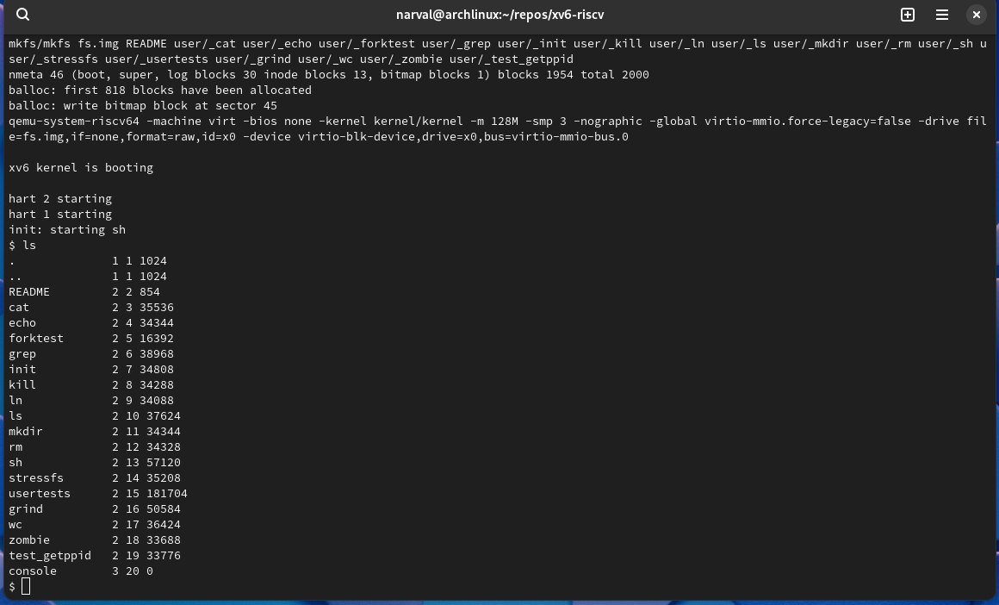
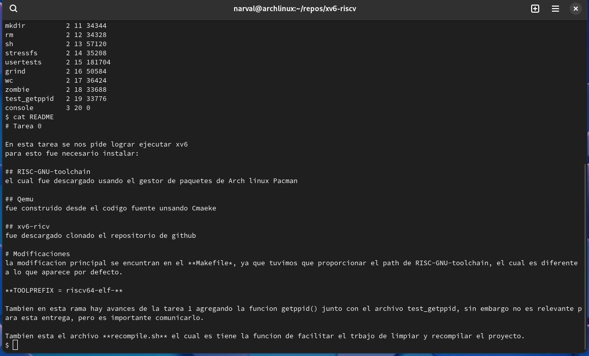

# Tarea 0

En esta tarea se nos pide lograr ejecutar xv6, en mi caso particular sera ejecutado en Arch linux
para esto fue necesario instalar:

## RISC-GNU-toolchain
el cual fue descargado usando el gestor de paquetes de Arch linux **Pacman**.

## Qemu
fue construido desde el codigo fuente unsando Cmaeke, debido a que la descarga mediante el gestor de paquete **Pacman y Paru** deban problemas. Para esto fue necesario inestlar **Cmake**. Una vez compilado el proyecto se añadio al path usando enlaces simbolicos a la cartpete usr/bin.

## xv6-ricv
fue descargado haciendo fork del proyecto original y luego clonando el repositorio.

# Modificaciones
la modificacion principal se encuntran en el **Makefile*, ya que tuvimos que proporcionar el path de RISC-GNU-toolchain, el cual es diferente a lo que aparece por defecto.

**TOOLPREFIX = riscv64-elf-**

Tambien en esta rama hay avances de la tarea 1 agregando la funcion getppid() junto con el archivo test_getppid, sin embargo no es relevante para esta entrega, pero es importante comunicarlo.

Tambien esta el archivo **recompile.sh** el cual es tiene la funcion de facilitar el trbajo de limpiar y recompilar el proyecto.

# Imagenes

  

